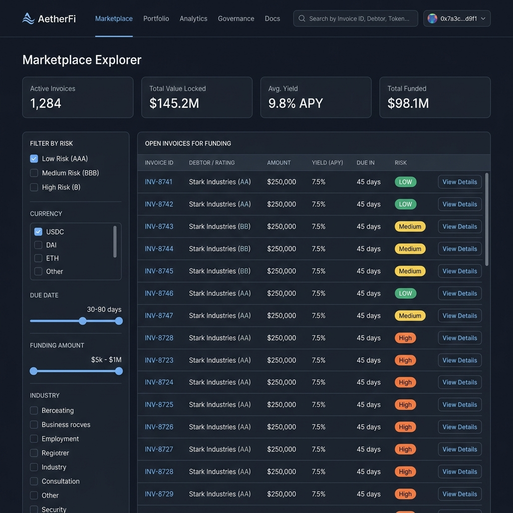

# Invoice Liquidity Network (ILN) — Frontend

[](https://github.com/Invoice-Liquidity-Network/ILN-Frontend/actions/workflows/ci.yml)
[](https://codecov.io/gh/Invoice-Liquidity-Network/ILN-Frontend)
[](https://nextjs.org/)
[](https://www.typescriptlang.org/)

An open-source invoice factoring protocol built on the Stellar network. ILN lets freelancers get paid immediately for outstanding invoices by selling them at a discount to liquidity providers, who earn short-term yield for funding them. This repository is the Next.js web client: wallet connection, invoice submission and funding flows, governance, analytics, and the protocol's public-facing dashboards.

- **Network**: Stellar Testnet (Soroban smart contracts)

---

## Table of Contents

- [Overview](#overview)
- [Key Features](#key-features)
- [Tech Stack](#tech-stack)
- [Project Structure](#project-structure)
- [Getting Started](#getting-started)
  - [Prerequisites](#prerequisites)
  - [Installation](#installation)
  - [Environment Variables](#environment-variables)
  - [Running the App](#running-the-app)
- [Available Scripts](#available-scripts)
- [Testing](#testing)
- [Documentation](#documentation)
- [Design System](#design-system)
- [Contributing](#contributing)
- [Security](#security)
- [License](#license)

---

## Overview

ILN bridges the gap between freelancers who need cash flow today and liquidity providers looking for short-term, invoice-backed yield. A freelancer submits an invoice on-chain; a liquidity provider funds it at a discount; the payer settles it on its due date; the LP collects the spread. All of this is coordinated by a Soroban smart contract, with this frontend providing the interface for every participant role: freelancers, payers, liquidity providers, governance voters, and protocol admins.

The app is a single Next.js project (App Router) that talks directly to Soroban RPC and Horizon for on-chain state, uses Supabase for off-chain reminder preferences, and Freighter (or WalletConnect) for wallet signing — there is no separate backend service for core protocol interactions.

## Key Features

- **Invoice origination & management** — submit single or batched invoices, view public invoice detail pages, export tables, generate PDFs, and share invoice QR codes / deep links.
- **Funding marketplace** — browse open invoices, inspect payer risk, fund invoices, compare opportunities, and track LP portfolio allocation, yield, and transfers.
- **Payer workflows** — pay invoices, mark invoices as paid, open disputes, opt into email reminders, and view payer-specific dashboard state.
- **Analytics & stats** — protocol-wide metrics, volume charts, token breakdowns, dispute rates, yield analytics, freelancer cash-flow analytics, and a leaderboard.
- **Governance & admin** — create/list/vote on proposals, delegate voting power, manage the token allowlist, and view protocol health and contract version info.
- **Growth & engagement** — referrals, product roadmap, reputation profiles with a score simulator, an in-app notification center, a command palette, onboarding tours, and a PWA offline fallback page.
- **Internationalization & theming** — multi-locale support via `next-intl`/`i18next`, with light/dark theme support.

## Tech Stack

| Category               | Tools                                                                                                              |
| ---------------------- | ------------------------------------------------------------------------------------------------------------------ |
| Framework              | [Next.js 16](https://nextjs.org/) (App Router, Turbopack), React 19, TypeScript 5                                  |
| Package manager        | pnpm 9, with a committed `pnpm-lock.yaml`                                                                          |
| Styling                | Tailwind CSS v4, PostCSS, `next-themes` for light/dark mode                                                        |
| Blockchain integration | `@stellar/stellar-sdk` (Soroban RPC, transaction simulation, XDR parsing, Horizon reads), `@stellar/freighter-api` |
| Data fetching & cache  | TanStack Query (`@tanstack/react-query`)                                                                           |
| Internationalization   | `next-intl`, `i18next`, `i18next-browser-languagedetector`, `react-i18next`                                        |
| PWA & offline          | `next-pwa`, a generated service worker, `public/manifest.json`                                                     |
| Notifications & email  | `sonner`, `@supabase/supabase-js`, React Email, Resend                                                             |
| Charts & exports       | `recharts`, `jspdf`, `papaparse`, `qrcode` / `qrcode.react`                                                        |
| Guided UX & icons      | `react-joyride`, `lucide-react`                                                                                    |
| Component workshop     | Storybook 10 (local component development; see [Documentation](#documentation) for CI status)                      |
| Mocking                | Mock Service Worker (MSW)                                                                                          |
| Testing                | Vitest, Testing Library, jest-axe, Playwright, Stryker (mutation testing)                                          |

## Project Structure

```
├── app/                       # Next.js App Router — the live route tree
│   ├── admin/                 # Admin health & protocol configuration dashboard
│   ├── analytics/             # Protocol, leaderboard, and freelancer analytics
│   ├── api/                   # Feedback, notifications, and reminder cron endpoints
│   ├── dashboard/             # Personalized dashboard routes
│   ├── freelancer/            # Freelancer dashboard
│   ├── governance/            # Proposal list, detail, creation, and explainer routes
│   ├── i/[id]/                # Public invoice detail route
│   ├── invoices/batch/        # Batch invoice submission
│   ├── leaderboard/           # Protocol leaderboard
│   ├── lp/                    # LP dashboard and invoice comparison
│   ├── marketplace/           # Open invoices explorer
│   ├── offline/               # PWA offline fallback page
│   ├── pay/[id]/               # Payer checkout and dispute flow
│   ├── payer/                 # Payer dashboard and reminder opt-in
│   ├── profile/[address]/     # Reputation and activity profile
│   ├── referrals/             # Referral dashboard
│   ├── roadmap/               # Product roadmap
│   ├── stats/                 # Protocol stats
│   ├── submit/                # Invoice submission flow
│   ├── tokens/                # Accepted token reference page
│   └── Providers.tsx           # TanStack Query & MSW provider setup
├── src/
│   ├── components/            # Reusable UI components
│   ├── context/                # Global React contexts (wallet, notifications, toasts)
│   ├── hooks/                  # Custom hooks and background polling
│   ├── lib/                    # Services layer (Stellar SDK, Supabase client, Horizon)
│   ├── utils/                  # General helpers (reputation decay, formatting, health checks)
│   └── app/                    # Legacy route tree — see docs/architecture.md, not the live routes
└── e2e/                        # Playwright end-to-end specs
```

> `src/app/` is a legacy tree kept around for older route experiments and is **not** what Next.js actually serves — `app/` at the repository root is the live route tree. See [Frontend Architecture Overview](docs/architecture.md) for the full explanation and directory-by-directory breakdown.

### Core Component Layers

1. **Smart contract layer** (`src/lib/contract/`, `src/lib/invoice-nft.ts`, `src/utils/soroban.ts`) — connects UI actions to the Soroban smart contract, reconstructs Invoice NFT metadata, and tracks mint/burn/transfer history from Horizon transaction logs and contract simulation.
2. **State & context layer** (`src/context/`) — `WalletContext` (Freighter/WalletConnect connection, multi-token balances), `NotificationContext` (in-app notification history), `ToastContext` (Sonner-backed alerts).
3. **Background polling** (`src/hooks/usePositionPolling.ts`) — watches funded-invoice state transitions (`Funded → Paid`, `Funded → Defaulted`, `Funded → Disputed`) for the connected LP every 60 seconds and surfaces due-date warnings.
4. **Payer email reminders** (`app/api/reminders/`) — a cron-triggered route that reads Supabase reminder preferences, sends 72h/24h warning emails via Resend, and records deliveries to prevent duplicates.

## Getting Started

### Prerequisites

- **Node.js** — the version pinned in [`.nvmrc`](.nvmrc) (`>=20.19.0 <21`, currently `20.20.2`)
- **pnpm 9** — enable via Corepack (see below)
- **Freighter** browser extension, configured for Stellar Testnet — [Chrome](https://chromewebstore.google.com/detail/freighter/bcacfldlkkdogcffkeieiokmgtzutddc) / [Firefox](https://addons.mozilla.org/en-US/firefox/addon/freighter/)

### Installation

```bash
corepack enable
corepack prepare pnpm@9.0.0 --activate
pnpm install
```

`pnpm install` also runs Husky's `prepare` script, which wires up `.husky/pre-commit` (lint-staged) and `.husky/pre-push` (`tsc --noEmit`).

### Environment Variables

```bash
cp .env.local.example .env.local
```

The checked-in example ships with safe Stellar Testnet defaults, so local UI development works without any extra setup. The tables below cover what each group of variables does; `pnpm run env:check` verifies the example file stays in sync with what the code actually references.

<details>
<summary><b>Stellar & smart contract configuration</b></summary>

| Variable                               | Default                                                    | Description                                                   |
| -------------------------------------- | ---------------------------------------------------------- | ------------------------------------------------------------- |
| `NEXT_PUBLIC_CONTRACT_ID`              | `CD3TE3IAHM737P236XZL2OYU275ZKD6MN7YH7PYYAXYIGEH55OPEWYJC` | Invoice Factoring smart contract ID on Soroban Testnet.       |
| `NEXT_PUBLIC_NETWORK_PASSPHRASE`       | `Test SDF Network ; September 2015`                        | Stellar network passphrase.                                   |
| `NEXT_PUBLIC_RPC_URL`                  | `https://soroban-testnet.stellar.org`                      | Soroban RPC endpoint.                                         |
| `NEXT_PUBLIC_NETWORK_NAME`             | `TESTNET`                                                  | Human-readable network label (`TESTNET`, `MAINNET`, `LOCAL`). |
| `NEXT_PUBLIC_STELLAR_NETWORK`          | `testnet`                                                  | Network type identifier (`testnet`, `public`).                |
| `NEXT_PUBLIC_TESTNET_USDC_TOKEN_ID`    | `CCW67TSZV3SSS2HXMBQ5JFGCKJNXKZM7UQUWUZPUTHXSTZLEO7SJMI75` | USDC asset contract ID on testnet.                            |
| `NEXT_PUBLIC_TESTNET_EURC_TOKEN_ID`    | `GDHU6WRG4IEQXM5NZ4BMPKOXHW76MZM4Y2IEMFDVXBSDP6SJY4ITNPP`  | EURC asset contract ID on testnet.                            |
| `NEXT_PUBLIC_TESTNET_XLM_TOKEN_ID`     | `native-xlm`                                               | Native XLM token identifier.                                  |
| `NEXT_PUBLIC_GOVERNANCE_ADMIN_ADDRESS` | `GAAAAAAAAAAAAAAAAAAAAAAAAAAAAAAAAAAAAAAAAAAAAAAAAAAAAWHF` | Fallback admin address for governance parameters.             |

</details>

<details>
<summary><b>Feature flags</b></summary>

| Variable                             | Default     | Description                                                       |
| ------------------------------------ | ----------- | ----------------------------------------------------------------- |
| `NEXT_PUBLIC_INSURANCE_POOL_ENABLED` | `false`     | Enables the liquidity insurance pool UI.                          |
| `NEXT_PUBLIC_ORACLE_ENABLED`         | `false`     | Displays oracle price-feed verification badges.                   |
| `NEXT_PUBLIC_NFT_ENABLED`            | `false`     | Enables Soroban Invoice NFT metadata display.                     |
| `NEXT_PUBLIC_NFT_CONTRACT_ID`        | _(unset)_   | Overrides the NFT contract ID (defaults to the main contract ID). |
| `NEXT_PUBLIC_NFT_METADATA_METHOD`    | `token_uri` | Contract method used to resolve NFT metadata.                     |
| `NEXT_PUBLIC_NFT_EVENT_HINTS`        | _(unset)_   | Optional event-name hints for NFT event parsing.                  |
| `NEXT_PUBLIC_API_MOCKING`            | `disabled`  | Set to `enabled` to start MSW mocks in local development.         |

See [docs/feature-flags.md](docs/feature-flags.md) for the full reference, including where each flag is read.

</details>

<details>
<summary><b>Indexer, notifications & email (server / cron)</b></summary>

| Variable                               | Description                                                                                |
| -------------------------------------- | ------------------------------------------------------------------------------------------ |
| `NEXT_PUBLIC_INDEXER_API_URL`          | Indexer REST API base URL (activity feed, analytics charts).                               |
| `NEXT_PUBLIC_INDEXER_WS_URL`           | Indexer WebSocket URL for real-time updates.                                               |
| `INDEXER_URL`                          | Server-side indexer URL (leaderboard, server functions).                                   |
| `NOTIFICATION_API`                     | External backend base URL for notifications.                                               |
| `NEXT_PUBLIC_SUPABASE_URL`             | Supabase project URL.                                                                      |
| `NEXT_PUBLIC_SUPABASE_ANON_KEY`        | Supabase anonymous (browser-safe) key.                                                     |
| `SUPABASE_SERVICE_ROLE_KEY`            | Server-only key used by the reminder cron to bypass RLS.                                   |
| `RESEND_API_KEY`                       | Resend API key used to send payer reminder emails.                                         |
| `CRON_SECRET`                          | Secret used to authorize `GET /api/reminders` (the cron trigger).                          |
| `NEXT_PUBLIC_WALLETCONNECT_PROJECT_ID` | WalletConnect project ID, from [cloud.walletconnect.com](https://cloud.walletconnect.com). |

Local UI development works fine without these — they only matter when exercising Supabase-backed reminders, email delivery, or WalletConnect. See [docs/supabase-setup.md](docs/supabase-setup.md) for the reminder schema.

</details>

<details>
<summary><b>App metadata & GitHub feedback integration</b></summary>

| Variable                                        | Default                   | Description                                                        |
| ----------------------------------------------- | ------------------------- | ------------------------------------------------------------------ |
| `NEXT_PUBLIC_APP_URL`                           | `https://app.iln.finance` | Base URL used in email links and deep links.                       |
| `NEXT_PUBLIC_APP_VERSION`                       | `dev`                     | Version label shown in in-app release notes.                       |
| `NEXT_PUBLIC_CONTRACT_VERSION`                  | `testnet:CD3TE3IA`        | Contract version label shown in the admin health dashboard.        |
| `GITHUB_TOKEN` / `GITHUB_OWNER` / `GITHUB_REPO` | _(unset)_                 | Used by the in-app feedback widget to file GitHub issues directly. |

</details>

Runtime-injected variables that don't belong in `.env.local.example` (like `NODE_ENV`) are tracked in `.env.local.example.allowlist` instead, and are exempt from `env:check`.

### Running the App

```bash
pnpm dev
```

Open [http://localhost:3000](http://localhost:3000). To use a funded testnet wallet: open Freighter, switch to **Testnet**, copy your public key, fund it via the [Stellar Testnet Friendbot](https://friendbot.stellar.org/?addr=YOUR_PUBLIC_KEY), then connect Freighter from the app navbar.

## Available Scripts

| Command                            | Purpose                                                               |
| ---------------------------------- | --------------------------------------------------------------------- |
| `pnpm dev`                         | Start the Next.js development server                                  |
| `pnpm build`                       | Create a production build                                             |
| `pnpm start`                       | Serve the production build                                            |
| `pnpm run lint`                    | Run ESLint                                                            |
| `pnpm run lint:fix`                | Run ESLint with automatic fixes                                       |
| `pnpm run format` / `format:check` | Write / check Prettier formatting                                     |
| `pnpm run env:check`               | Verify `.env.local.example` covers every env var the code references  |
| `pnpm test`                        | Run the Vitest unit/integration suite once                            |
| `pnpm run test:watch`              | Run Vitest in watch mode                                              |
| `pnpm run test:e2e`                | Run the Playwright end-to-end suite                                   |
| `pnpm run test:mutation`           | Run Stryker mutation testing                                          |
| `pnpm run verify`                  | Lint + env:check + format:check + typecheck + unit tests, in one shot |
| `pnpm run storybook`               | Start Storybook locally on port 6006                                  |
| `pnpm run build-storybook`         | Build static Storybook output                                         |
| `pnpm run chromatic`               | Run Chromatic visual regression checks                                |
| `pnpm run clean`                   | Remove build/test caches (`.next`, `.turbo`, `coverage`, etc.)        |
| `pnpm run scaffold:component`      | Scaffold a new component with a matching story/test file              |
| `pnpm run generate:changelog`      | Regenerate `CHANGELOG.md` via git-cliff                               |

## Testing

The project uses a layered testing strategy rather than one tool for everything — see [docs/testing.md](docs/testing.md) for the full breakdown of when to reach for which tool. In short:

- **Vitest** + Testing Library for unit, hook, and component behavior (`__tests__/`, `src/**/__tests__/`).
- **Playwright** for critical end-to-end flows — wallet connection, invoice workflows, governance, responsive layouts (`e2e/`).
- **jest-axe** for component-level accessibility regressions.
- **Storybook + Chromatic** for visual regression and UI documentation.
- **MSW** to mock network responses where a real backend or contract node isn't needed.
- **Stryker** for periodic mutation-testing coverage audits.

```bash
pnpm test              # unit/integration tests
pnpm run test:e2e      # Playwright end-to-end suite
pnpm run verify        # everything CI checks, in one command
```

## Documentation

### Start here

| Doc                                                    | What it covers                                                                    |
| ------------------------------------------------------ | --------------------------------------------------------------------------------- |
| [Developer Quickstart](docs/developer-quickstart.md)   | Full setup guide, including the dev container / Codespaces path.                  |
| [Frontend Architecture Overview](docs/architecture.md) | Data flows, directory-by-directory breakdown, the `app/` vs `src/app/` situation. |
| [Testing Strategy](docs/testing.md)                    | Which test tool to use for which kind of change.                                  |
| [Troubleshooting Guide](docs/troubleshooting.md)       | Local setup symptoms, Freighter connection, database gotchas.                     |
| [Contributing Guidelines](CONTRIBUTING.md)             | Branching, commit conventions, code style, PR process.                            |

### Reference

| Doc                                              | What it covers                                            |
| ------------------------------------------------ | --------------------------------------------------------- |
| [Route Map](docs/route-map.md)                   | Every canonical route, its purpose, and active redirects. |
| [Feature Flags Reference](docs/feature-flags.md) | Every `NEXT_PUBLIC_*` flag and what it gates.             |
| [API Routes](docs/api-routes.md)                 | Request/response shapes for the app's own API routes.     |
| [Error Codes Reference](docs/error-codes.md)     | Mapped contract error codes and remediation guidance.     |
| [i18n Setup Guide](docs/i18n.md)                 | Locale architecture and how to add a new locale.          |
| [Accessibility Conformance Statement](docs/accessibility-conformance-statement.md) | WCAG 2.1 AA target, verification summary, and known limitations. |
| [Supabase Setup](docs/supabase-setup.md)         | Schema and setup for the payer reminder flow.             |

### CI, quality gates & operations

| Doc                                                                | What it covers                                                             |
| ------------------------------------------------------------------ | -------------------------------------------------------------------------- |
| [CI/CD Overview](docs/ci-cd.md)                                    | Workflow triggers, required status checks, runner configuration.           |
| [Visual Regression Workflow](docs/VISUAL_REGRESSION_WORKFLOW.md)   | Chromatic baseline configuration.                                          |
| [Lighthouse CI](docs/LIGHTHOUSE_CI.md)                             | Performance budget thresholds and how they're enforced.                    |
| [Bundle Size Tracking](docs/bundle-size.md)                        | Bundle budget policy and how the size-check workflow works.                |
| [Contract Fixtures](docs/contract-fixtures.md)                     | Test fixtures used for Soroban contract interaction tests.                 |
| [Contract Integration Status](docs/contract-integration-status.md) | Current status of live contract integration coverage.                      |
| [Screen Reader Testing Guide](docs/screen-reader-testing-guide.md) | Manual a11y verification steps beyond automated checks.                    |
| [Incident Response Process](docs/incident-response.md)             | Frontend-specific security incident response process.                      |
| [PWA Manifest Audit](docs/pwa-manifest-audit.md)                   | Manifest/icon production-readiness findings and manual sign-off checklist. |

<details>
<summary><b>Additional internal references</b></summary>

| Doc                                                                                       | What it covers                                                       |
| ----------------------------------------------------------------------------------------- | -------------------------------------------------------------------- |
| [Payer Routes Audit](docs/payer-routes.md)                                                | Notes on the canonical payer dashboard route and historical aliases. |
| [Repo Size Audit](docs/repo-size-audit.md)                                                | Notes on repository/build artifact size.                             |
| [Good First Issue Candidates](docs/good-first-issue-candidates.md)                        | Curated, self-contained issues for new contributors.                 |
| [Accessibility Implementation Summary](docs/accessibility-implementation-summary.md)      | Summary of a11y work completed to date.                              |
| [Toast Notification Accessibility Audit](docs/accessibility-audit-toast-notifications.md) | Audit notes specific to the toast notification system.               |

</details>

## Design System

The UI follows a curated design language called **The Fiscal Atelier** — a "Warm Industrial" aesthetic combining structural Navy/Slate with warm parchment grays, a "no 1px borders" rule (containment via background-shift instead), and a typography pairing of _Newsreader_ (serif, for display statements and data points) with _Manrope_ (sans-serif, for functional UI text).

Read the full breakdown — layout grids, elevation layers, and color tokens — in [DESIGN.md](DESIGN.md).

## Contributing

Contributions are welcome. Please read [CONTRIBUTING.md](CONTRIBUTING.md) first — it covers setup, testing standards, code style, and Stellar-specific conventions in detail. The short version:

### 🔍 Marketplace Explorer

A central marketplace listing all active open invoices waiting for funding, detailed interest rates, and risk rankings.


---

## 🔗 Useful Links & Documentation

- **Documentation Index**: Browse all project documentation in [docs/README.md](docs/README.md).
- **Getting Started Guide**: Refer to the [Quick Start](#-quick-start) section.
- **Component Library (Storybook)**: Browse the full component library with interactive controls, variants, and a11y checks at the [published Storybook](https://invoice-liquidity-network.github.io/ILN-Frontend) (deployed from `main`).
- **Frontend Architecture Overview**: Learn about our architecture design and libraries in [docs/architecture.md](docs/architecture.md).
- **useWallet Hook Documentation**: Detailed guide for wallet integration and SEP-10 authentication in [docs/hooks/use-wallet.md](docs/hooks/use-wallet.md).
- **Contribution Guidelines**: Read [CONTRIBUTING.md](CONTRIBUTING.md) for comprehensive setup instructions, testing standards, code style guidelines, Stellar-specific setup, and development workflow.
- **Visual Regression Testing**: Learn about baseline configurations in [docs/VISUAL_REGRESSION_WORKFLOW.md](docs/VISUAL_REGRESSION_WORKFLOW.md).
- **Design System Blueprint**: Deep dive into "The Fiscal Atelier" aesthetic rules in [DESIGN.md](DESIGN.md).
- **Live Deployed App**: Access the application on [app.iln.finance](https://app.iln.finance).

---

## 🤝 Contributing

Contributions are welcome! Please read our [CONTRIBUTING.md](CONTRIBUTING.md) first.

1. Create a branch: `git checkout -b feature/your-feature-name`
2. Make your changes, and add/update stories and tests for any component behavior you touch.
3. Commit using conventional commit format: `feat(scope): describe the change`.
4. Run `pnpm run verify` locally before opening a PR.
5. Open a pull request against `main` (or `develop`, depending on the target — see [docs/ci-cd.md](docs/ci-cd.md) for branch-specific required checks).

New to the codebase? [Good First Issue Candidates](docs/good-first-issue-candidates.md) is a curated starting point.

## Security

This is a live financial application interacting with Soroban smart contracts and user wallets. If you find a security issue, please follow the disclosure process in [SECURITY.md](SECURITY.md) rather than opening a public issue — it also links to the [frontend incident response process](docs/incident-response.md).

## License

This repository does not currently declare a license file. Contact the maintainers before reusing or redistributing code from this repository.
