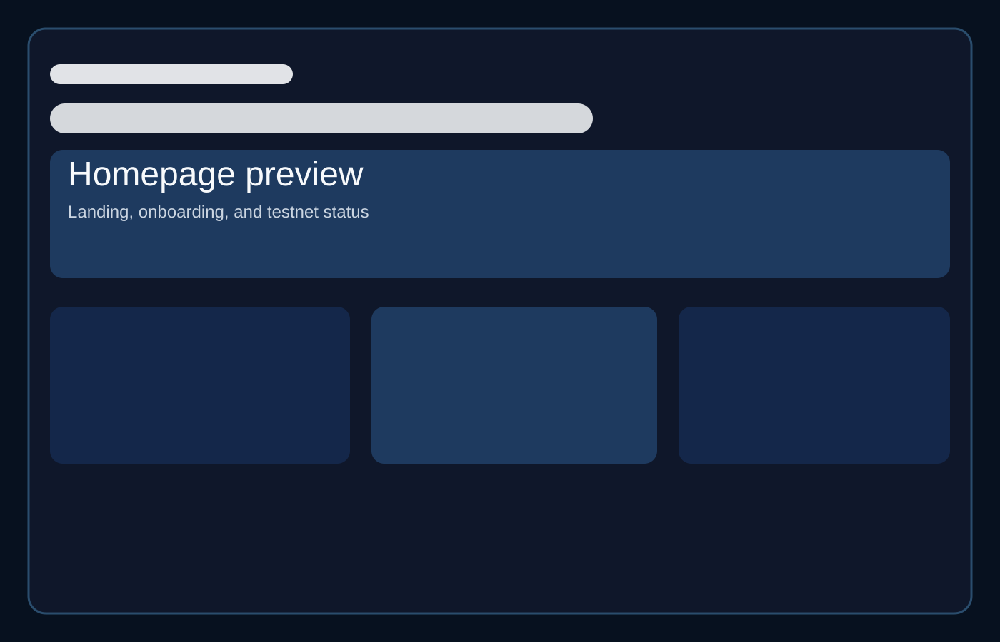
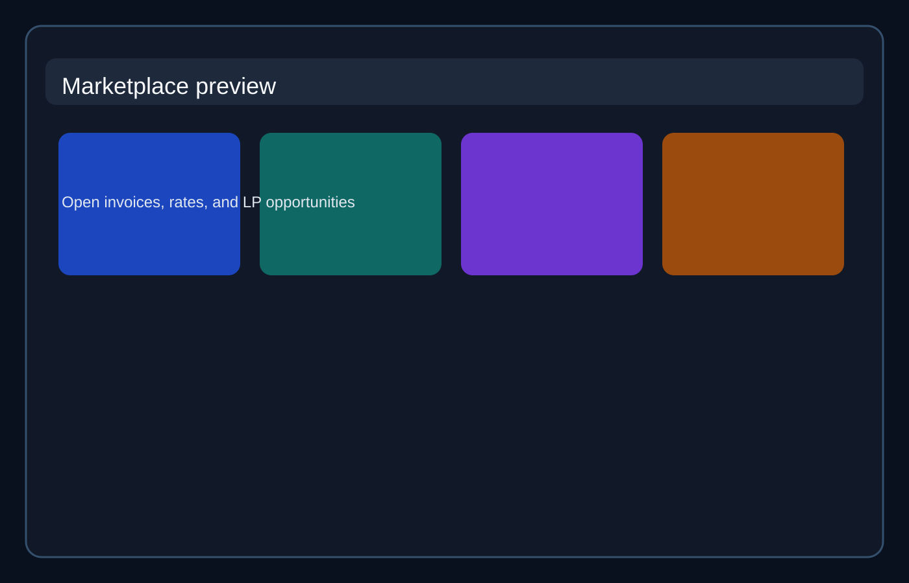
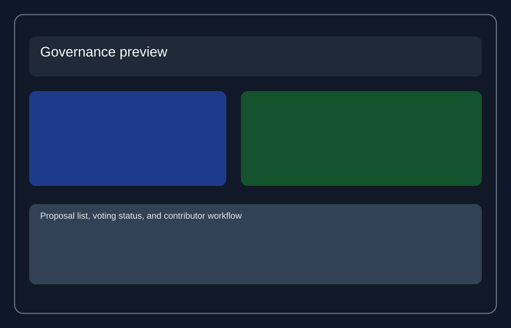
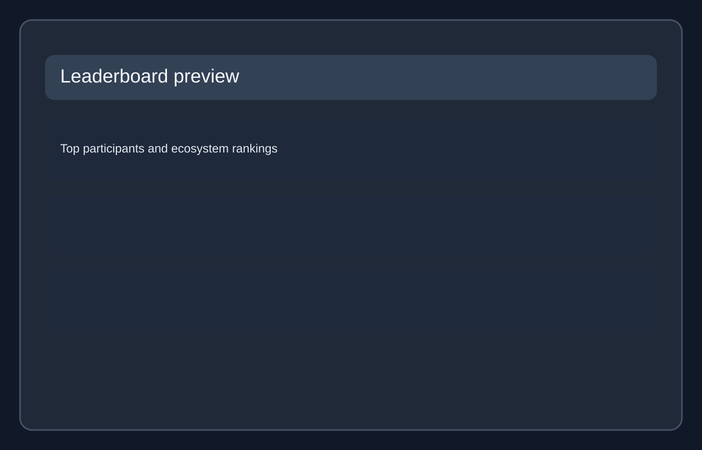
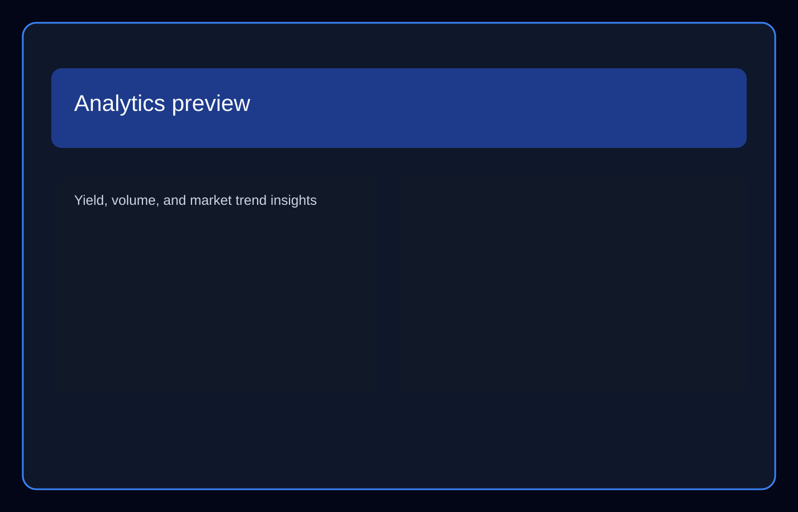

# Invoice Liquidity Network (ILN) Frontend

An open-source invoice factoring protocol built on the Stellar network. ILN bridges the gap between freelancers seeking immediate payment and liquidity providers looking for short-term yields.

---

## 🎨 Creative North Star: "The Fiscal Atelier"

The user interface follows a curated design system strategy known as **The Fiscal Atelier**. Rather than standard sterile, template-locked fintech designs, ILN provides a bespoke workspace where precision meets editorial warmth.

- **Color & Tonal Architecture**: Rooted in a "Warm Industrial" aesthetic combining structural Navy/Slate with warm parchment grays.
- **The "No-Line" Rule**: The layout explicitly avoids 1px borders for containment, using background shifts (`surface`, `surface-container-low`, `surface-container-high`) to create architectural boundaries.
- **Typography Dialogue**: Pairs the editorial authority of the _Newsreader_ serif typeface for display statements and data points with the functional clarity of the _Manrope_ sans-serif.

For a deep dive into layout grids, elevation layers, and color tokens, read the full [DESIGN.md](DESIGN.md) document.

---

## 🛠 Tech Stack

- **Framework**: [Next.js 16.2.4 (App Router)](https://nextjs.org/) & React 19.2.4
- **Language**: TypeScript 5
- **Package manager**: pnpm with a committed `pnpm-lock.yaml`
- **Styling**: Tailwind CSS v4, PostCSS, and `next-themes` for light/dark theme state
- **Blockchain Integration**:
  - `@stellar/stellar-sdk` for Soroban RPC, transaction simulation, XDR parsing, and Horizon reads
  - `@stellar/freighter-api` for Freighter wallet connection and signing
- **Data Fetching & Cache**: `@tanstack/react-query` (React Query)
- **Internationalization**: `next-intl`, `i18next`, `i18next-browser-languagedetector`, and `react-i18next`
- **PWA & Offline**: `next-pwa`, `public/manifest.json`, and generated service-worker assets
- **Notifications & Email**: `sonner`, Supabase JS (`@supabase/supabase-js`), React Email, and Resend
- **Charts & Exports**: `recharts`, `jspdf`, `papaparse`, `qrcode`, and `qrcode.react`
- **Guided UX & Icons**: `react-joyride` and `lucide-react`
- **Visual Testing**: Storybook 10 and Chromatic
- **Mocking**: Mock Service Worker (MSW)
- **Testing**: Vitest, Testing Library, jest-axe, Playwright, and Stryker

---

## 🏗 Application Architecture

For a deep dive into data flows, component interactions, and key trade-offs, refer to the [Frontend Architecture Overview](docs/architecture.md).

The application supports a broad route surface for freelancers, payers, liquidity providers, governance participants, admins, and protocol observers.

### 📁 Directory Layout

```
├── app/                      # Next.js App Router root
│   ├── admin/                # Admin health and protocol configuration dashboard
│   ├── analytics/            # Protocol, leaderboard, and freelancer analytics
│   ├── api/                  # Auth, feedback, notifications, and reminder endpoints
│   ├── dashboard/            # Personalized dashboard routes
│   ├── freelancer/           # Freelancer dashboard
│   ├── governance/           # Proposal list, detail, creation, and explainer routes
│   ├── i/[id]/               # Public invoice detail route
│   ├── leaderboard/          # Protocol leaderboard
│   ├── lp/                   # LP dashboard and invoice comparison route
│   ├── marketplace/          # Open invoices explorer
│   ├── offline/              # PWA offline fallback page
│   ├── pay/[id]/             # Payer checkout and dispute flow
│   ├── payer/                # Payer dashboard and reminder opt-in
│   ├── profile/[address]/    # Reputation and activity profile
│   ├── referrals/            # Referral dashboard
│   ├── roadmap/              # Product roadmap
│   ├── stats/                # Protocol stats
│   ├── submit/               # Invoice submission flow
│   └── Providers.tsx         # TanStack Query & MSW Provider setup
├── src/
│   ├── components/           # Reusable UI components (Bells, Drawers, Badges)
│   ├── context/              # Global React Contexts (Wallet, Notifications, Toasts)
│   ├── hooks/                # Custom React Hooks & background polling
│   ├── lib/                  # Services layer (Stellar SDK, Supabase client, Horizon)
│   └── utils/                # General helpers (reputation decay, health checks)
```

### 🧩 Implemented Product Areas

- **Invoice origination and management**: submit single invoices, batch invoices, review public invoice details, export tables, generate PDFs, and share invoice QR/deep links.
- **Funding marketplace**: filter open invoices, inspect payer risk, fund invoices, compare opportunities, and track LP portfolio allocation, yield, and transfers.
- **Payer workflows**: pay invoices, mark invoices as paid, open disputes, opt into reminders, and view payer-specific dashboard state.
- **Analytics and stats**: protocol metrics, volume charts, token breakdowns, dispute rates, yield analytics, freelancer cash-flow analytics, and leaderboard views.
- **Governance and admin**: proposal list/detail/create routes, voting and delegation components, token allowlist controls, parameter banners, admin health checks, and contract version display.
- **Growth and engagement**: referrals dashboard, roadmap page, profile reputation charts, score simulator, notification center, command palette, onboarding, tours, PWA offline page, and theme support.

### 🧩 Core Component Layers

1. **Smart Contract Layer (`src/lib/invoice-nft.ts`, `src/lib/contract/`, and `src/utils/soroban.ts`)**

   - Connects frontend actions to the Soroban smart contract.
   - Reconstructs Invoice NFT metadata and tracks mint/burn/transfer event history by scanning Horizon transaction logs and simulating Soroban contract invocations.

2. **State & Context Layer (`src/context/`)**

   - **`WalletContext`**: Monitors Freighter wallet connection, active address, and queries multi-token balances (USDC, EURC, XLM) on Stellar.
   - **`NotificationContext`**: Handles in-app notification center persistence via `localStorage` (caps at 20 logs).
   - **`ToastContext`**: Wraps Sonner-powered non-blocking alerts.

3. **Background Polling & Sync (`src/hooks/usePositionPolling.ts`)**

   - Monitors state transitions of funded invoices (e.g. `Funded -> Paid`, `Funded -> Defaulted`, or `Funded -> Disputed`) for the connected LP. It runs queries every 60 seconds and notifies the LP about due date expiration.

4. **Payer Email Reminders (`app/api/reminders/`)**
   - Allows payers to opt-in using their email. A background cron script checks for funded invoices due in 72 hours and 24 hours, queries preferences from a Supabase table, sends warning templates via Resend, and logs records to prevent duplicate deliveries.

---

## 🚀 Quick Start

### Prerequisites

- Node.js 20.9.0 through Node 20.x (`.nvmrc` pins `20.9.0`)
- pnpm 9+
- Freighter browser extension configured for Stellar Testnet

### 1. Install Dependencies

```bash
corepack enable
corepack prepare pnpm@9.0.0 --activate
pnpm install
```

### 2. Configure Environment Variables

Copy `.env.local.example` to `.env.local` (see the [Environment Variables](#-environment-variables-reference) section below for details):

```bash
cp .env.local.example .env.local
```

### 3. Run Development Server

```bash
pnpm dev
```

Open [http://localhost:3000](http://localhost:3000) with your browser.

### 4. Running Tests

- **Unit & Snapshot Tests (Vitest)**:
  ```bash
  pnpm test
  ```
  To update Vitest snapshot files after intentional UI changes, run:
  ```bash
  pnpm test -- --update-snapshots
  ```
- **End-to-End Tests (Playwright)**:
  ```bash
  pnpm run test:e2e
  ```

### 5. Storybook & Visual Regression

Storybook and Chromatic are used to check UI components for regressions.

- **Start Storybook locally**:
  ```bash
  pnpm run storybook
  ```
- **Run visual regression checks**:
  ```bash
  pnpm run chromatic
  ```

---

## 🔑 Environment Variables Reference

Here is a detailed guide of the configuration options available:

### 🌐 Stellar & Smart Contract Settings

| Variable                               | Default Value                                              | Description                                                       |
| :------------------------------------- | :--------------------------------------------------------- | :---------------------------------------------------------------- |
| `NEXT_PUBLIC_CONTRACT_ID`              | `CD3TE3IAHM737P236XZL2OYU275ZKD6MN7YH7PYYAXYIGEH55OPEWYJC` | The primary Invoice Factoring smart contract ID on Soroban.       |
| `NEXT_PUBLIC_NETWORK_PASSPHRASE`       | `Test SDF Network ; September 2015`                        | Stellar network identifier passphrase.                            |
| `NEXT_PUBLIC_RPC_URL`                  | `https://soroban-testnet.stellar.org`                      | Soroban RPC server endpoint.                                      |
| `NEXT_PUBLIC_NETWORK_NAME`             | `TESTNET`                                                  | Descriptive name of the active Stellar network.                   |
| `NEXT_PUBLIC_STELLAR_NETWORK`          | `testnet`                                                  | Network type identifier (`testnet`, `public`).                    |
| `NEXT_PUBLIC_TESTNET_USDC_TOKEN_ID`    | `CCW67TSZV3SSS2HXMBQ5JFGCKJNXKZM7UQUWUZPUTHXSTZLEO7SJMI75` | Asset contract ID for USDC on testnet.                            |
| `NEXT_PUBLIC_TESTNET_EURC_TOKEN_ID`    | `GDHU6WRG4IEQXM5NZ4BMPKOXHW76MZM4Y2IEMFDVXBSDP6SJY4ITNPP`  | Asset contract ID for EURC on testnet.                            |
| `NEXT_PUBLIC_TESTNET_XLM_TOKEN_ID`     | `native-xlm`                                               | Token identifier for Native XLM.                                  |
| `NEXT_PUBLIC_GOVERNANCE_ADMIN_ADDRESS` | `GAAAAAAAAAAAAAAAAAAAAAAAAAAAAAAAAAAAAAAAAAAAAAAAAAAAAWHF` | Admin fallback address for parameters governance.                 |
| `NEXT_PUBLIC_INSURANCE_POOL_ENABLED`   | `false`                                                    | Enables/disables the liquidity insurance pooling feature.         |
| `NEXT_PUBLIC_NFT_ENABLED`              | `false`                                                    | Set to `true` to enable Soroban Invoice NFT metadata displays.    |
| `NEXT_PUBLIC_NFT_CONTRACT_ID`          | Defaults to contract ID                                    | Contract ID for Invoice NFTs (if separated from primary).         |
| `NEXT_PUBLIC_NFT_METADATA_METHOD`      | `token_uri`                                                | Contract function that returns token metadata URI.                |
| `NEXT_PUBLIC_NFT_EVENT_HINTS`          | `""`                                                       | Hints helper (e.g., `mint:Minted;transfer:Transfer;burn:Burned`). |
| `NEXT_PUBLIC_API_MOCKING`              | `disabled`                                                 | Set to `enabled` to start MSW in local development.               |
| `NEXT_PUBLIC_APP_VERSION`              | `dev`                                                      | Version label for release-note state.                             |
| `NEXT_PUBLIC_CONTRACT_VERSION`         | `testnet:CD3TE3IA`                                         | Contract version label displayed in admin health checks.          |

### 🗄️ Notifications, Databases & Email (Backend/Cron)

| Variable                        | Description                                                                   |
| :------------------------------ | :---------------------------------------------------------------------------- |
| `NEXT_PUBLIC_SUPABASE_URL`      | The endpoint URL for the Supabase database.                                   |
| `NEXT_PUBLIC_SUPABASE_ANON_KEY` | Anonymous browser-safe public key for Supabase.                               |
| `SUPABASE_SERVICE_ROLE_KEY`     | Backend service key used by reminder crons to bypass RLS policies.            |
| `RESEND_API_KEY`                | API key from Resend.com used to dispatch payer reminder emails.               |
| `CRON_SECRET`                   | Secret token to secure `/api/reminders` GET trigger from unauthorized calls.  |
| `NOTIFICATION_API`              | External backend base URL to fetch notifications.                             |
| `INDEXER_URL`                   | Base API URL of the ILN contract data indexer.                                |
| `NEXT_PUBLIC_INDEXER_API_URL`   | Public indexer endpoint for activity feeds and analytics charts.              |
| `NEXT_PUBLIC_APP_URL`           | Base URL of the deployed application (defaults to `https://app.iln.finance`). |

### 🧪 Testing & Analytics

| Variable                                        | Description                                                          |
| :---------------------------------------------- | :------------------------------------------------------------------- |
| `NEXT_PUBLIC_API_MOCKING`                       | Set to `enabled` to run MSW mocks in local development.              |
| `NEXT_PUBLIC_ORACLE_ENABLED`                    | Set to `true` to display Oracle verification badges.                 |
| `GITHUB_TOKEN` / `GITHUB_OWNER` / `GITHUB_REPO` | Secrets used by the feedback widget to raise GitHub issues directly. |

---

## 📸 Screenshots

### 🏠 Homepage

The landing experience surfaces the ILN story, the testnet status, and the primary onboarding paths for freelancers and liquidity providers.


### 📊 Marketplace Explorer

A central marketplace listing active open invoices, discount rates, and funding opportunities for liquidity providers.


### 🏛 Governance

The governance surface highlights proposals, voting status, and the contributor workflow for protocol decisions.


### 📈 Protocol Stats

The stats experience summarizes protocol volume, activity, and performance metrics across the testnet deployment.


### 🏁 Leaderboard

The leaderboard exposes the most active users and participants across the ILN ecosystem.


### 📊 Analytics Dashboard

The analytics view brings together yield, volume, and market trends for deeper protocol analysis.


---

## 🔗 Useful Links & Documentation

- **Getting Started Guide**: Refer to the [Quick Start](#-quick-start) section.
- **Developer Quickstart**: Follow the full setup guide in [docs/developer-quickstart.md](docs/developer-quickstart.md).
- **Component Library (Storybook)**: Browse the full component library with interactive controls, variants, and a11y checks at the [published Storybook](https://invoice-liquidity-network.github.io/ILN-Frontend) (deployed from `main`).
- **Frontend Architecture Overview**: Learn about our architecture design and libraries in [docs/architecture.md](docs/architecture.md).
- **i18n Setup Guide**: Review the current i18n architecture and locale-addition workflow in [docs/i18n.md](docs/i18n.md).
- **Frontend Error Code Reference**: See the mapped contract error codes and remediation guidance in [docs/error-codes.md](docs/error-codes.md).
- **useWallet Hook Documentation**: Detailed guide for wallet integration and SEP-10 authentication in [docs/hooks/use-wallet.md](docs/hooks/use-wallet.md).
- **Contribution Guidelines**: Read [CONTRIBUTING.md](CONTRIBUTING.md) for comprehensive setup instructions, testing standards, code style guidelines, Stellar-specific setup, and development workflow.
- **Visual Regression Testing**: Learn about baseline configurations in [docs/VISUAL_REGRESSION_WORKFLOW.md](docs/VISUAL_REGRESSION_WORKFLOW.md).
- **Design System Blueprint**: Deep dive into "The Fiscal Atelier" aesthetic rules in [DESIGN.md](DESIGN.md).
- **Live Deployed App**: Access the application on [app.iln.finance](https://app.iln.finance).

---

## 🤝 Contributing

Contributions are welcome! Please read our [CONTRIBUTING.md](CONTRIBUTING.md) first.

1. Create a branch: `git checkout -b feature/your-feature-name`
2. Make your changes and write stories for new components.
3. Commit using conventional formats: `feat(scope): describe changes`
4. Run testing commands: `pnpm run lint`, `pnpm run env:check`, and `pnpm test`
5. Open a Pull Request.
