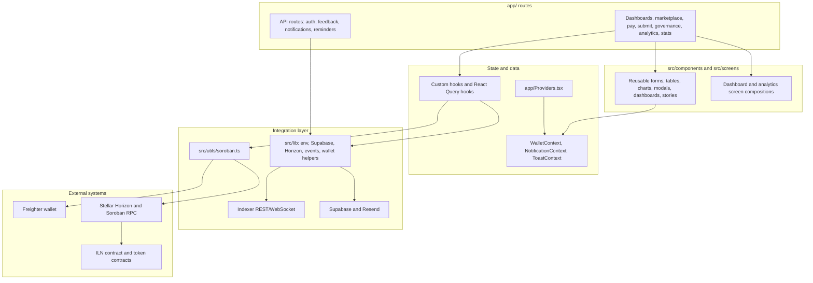

# Frontend Architecture Overview

This document describes the current structure, data flow, and library choices for the Invoice Liquidity Network (ILN) frontend. It is intentionally concise: enough context for contributors to understand where changes belong without duplicating implementation details from every route.

---

## System Shape

ILN is a Next.js App Router frontend for a Stellar/Soroban invoice liquidity protocol. The UI is organized around the protocol's main actors: freelancers submit invoices, liquidity providers fund them, payers settle or dispute them, governance users vote on proposals, and admins monitor protocol health.



## Route Surface

The primary route tree lives in `app/`. For a complete overview of canonical routes, purposes, primary consumers, and active redirects, refer to the [Route Map](route-map.md).

A small legacy `src/app/` tree still exists for older route experiments/tests and should be treated carefully when moving code.

```
app/
├── admin/                       # Admin health and protocol configuration
├── analytics/                   # Freelancer-specific cash-flow analytics (FreelancerAnalyticsDashboard)
├── api/
│   ├── feedback/                # GitHub-backed feedback submission
│   ├── notifications/[address]/ # Notification API bridge
│   └── reminders/               # Supabase/Resend payer reminder cron
├── dashboard/                   # Personalized dashboard
├── freelancer/                  # Freelancer workspace
├── governance/                  # Proposal list, detail, creation, explainer
├── i/[id]/                      # Public invoice detail
├── leaderboard/                 # Protocol leaderboard
├── lp/                          # LP dashboard
│   └── compare/                 # LP invoice comparison
├── marketplace/                 # Fundable invoice marketplace
├── offline/                     # PWA offline fallback
├── pay/[id]/                    # Payer checkout
│   └── dispute/                 # Invoice dispute route
├── payer/                       # Payer landing/dashboard route
├── profile/[address]/           # Reputation profile and activity
├── referrals/                   # Referral dashboard
├── roadmap/                     # Roadmap
├── stats/                       # Protocol stats
├── submit/                      # Invoice submission
├── layout.tsx                   # App shell
└── Providers.tsx                # React Query, theme, toast, MSW, app providers
```

Core supporting code is split by responsibility:

```
src/
├── components/                  # Reusable UI, charts, dashboards, stories
│   ├── analytics/               # Analytics widgets and tables
│   ├── charts/                  # Chart primitives and dynamic wrappers
│   ├── governance/              # Voting, delegation, allowlist controls
│   ├── invoices/                # Invoice-specific management widgets
│   ├── onboarding/              # Onboarding flow and spotlight helpers
│   └── ui/                      # Base UI primitives
├── context/                     # Context providers and consumer hooks (global state)
│   ├── WalletContext.tsx         # Wallet state, network checks, roles, signing
│   ├── NotificationContext.tsx   # In-app notification history
│   ├── ToastContext.tsx          # Toast message layer over Sonner
│   └── KeyboardShortcutsContext.tsx  # Keyboard shortcut and command palette state
├── hooks/                       # Custom hooks (no createContext); may consume context
│   ├── queries/                 # React Query keys and query hooks
│   └── useBrowserNotifications.ts # Browser Notification API wrapper
├── lib/                         # Env, Supabase, Horizon, events, notifications
├── screens/                     # Larger dashboard/screen compositions
├── utils/                       # Soroban, analytics, risk, exports, formatting
└── i18n.ts                      # i18next setup
```

## Data Flow

### Reads

Most contract and indexer reads flow through hooks:

1. A route or component calls a hook such as `useInvoices`, `useBalances`, `useContractStats`, `useRecentProtocolFeed`, or a hook under `src/hooks/queries/`.
2. The hook uses TanStack React Query for loading state, cache keys, refetch intervals, and invalidation.
3. Contract reads call `src/utils/soroban.ts` or `src/lib/*` helpers to simulate Soroban reads, parse XDR/ScVal data, query Horizon, or call an indexer endpoint.
4. Components receive typed data and render tables, cards, charts, badges, and dashboards.

### Writes

User-approved contract writes coordinate wallet state, transaction builders, and toasts:

1. The user triggers an action such as submit, fund, pay, mark paid, cancel, dispute, vote, delegate, or transfer.
2. A hook or utility builds and simulates the Soroban transaction.
3. `WalletContext` requests a Freighter signature and verifies the configured Stellar network.
4. The signed XDR is submitted and polled until resolution.
5. Sonner toasts communicate pending/success/error states, and React Query invalidates affected invoice, balance, stats, or governance queries.

### Server Routes

API routes are used for server-only integration points:

- `app/api/reminders/route.ts` reads Supabase reminder preferences and sends Resend emails when authorized by `CRON_SECRET`.
- `app/api/reminders/unsubscribe/route.ts` updates reminder preferences.
- `app/api/feedback/route.ts` can create GitHub issues from app feedback when GitHub credentials are configured.
- `app/api/notifications/[address]/route.ts` bridges notification reads by address.
- `app/api/leaderboard/route.ts` bridges leaderboard reads for `TopFundersWidget`.
- All of the above validate their inputs (Stellar address shape, allow-listed enum values, string/length limits) and apply a shared in-memory rate limiter from `src/lib/rate-limit.ts`, since each is a directly reachable server endpoint independent of any client-side validation.
- Contributor references for these server integrations live in [docs/supabase-setup.md](supabase-setup.md), [docs/feature-flags.md](feature-flags.md), [docs/api-routes.md](api-routes.md), and [docs/testing.md](testing.md).

## State, Providers, and UI Boundaries

- `app/Providers.tsx` wires global providers, React Query, theme behavior, toasts, and local MSW startup when `NEXT_PUBLIC_API_MOCKING=enabled`.
- `WalletContext` owns wallet address, provider state, network checks, role detection, balances, and signing.
- `NotificationContext` stores in-app notification history.
- `ToastContext` wraps toast behavior while `AppToaster` renders the Sonner host.
- `KeyboardShortcutsContext` manages keyboard shortcut state and global keydown listeners.
- Page routes should compose feature components and hooks; reusable components should stay under `src/components/`.
- Stellar SDK and RPC details should stay in `src/utils/soroban.ts`, `src/lib/`, or focused hooks rather than being called directly from presentational components. Integration status of live vs. stubbed contract details are tracked in [docs/contract-integration-status.md](contract-integration-status.md).

### Context vs Hooks Boundary

- **`src/context/`** — React Context providers and their consumer hooks (e.g., `WalletProvider` + `useWallet`,
  `ToastProvider` + `useToast`, `NotificationProvider` + `useNotification`,
  `KeyboardShortcutsProvider` + `useKeyboardShortcuts`). Context files own _shared global state_ that must
  be available to the entire subtree. If a file exports a `*Provider` or calls `createContext`, it belongs here.

- **`src/hooks/`** — Custom React hooks that do NOT define new contexts. They may consume context hooks
  to derive or transform state, manage local (component-level) state, wrap external APIs, or encapsulate
  effect-heavy logic. If a file exports only hook functions (that consume context or are pure utilities),
  it belongs here.

### Naming Conventions

- `useToast` — always imported from `@/context/ToastContext` (the former re-export `@/hooks/useToast` has been removed).
- `useWallet` — always imported from `@/context/WalletContext` for basic wallet state.
- `useNotification` (singular) — always imported from `@/context/NotificationContext` for in-app notification items.
- `useBrowserNotifications` (plural) — imported from `@/hooks/useBrowserNotifications` for the browser Notification API (permissions, desktop notifications).

### Avoiding Duplicate Polling & State

Invoice status changes are the primary source of duplication risk. To keep RPC usage predictable:

1. **React Query is the single source of truth** for contract reads. Hooks should prefer `useQuery`-based data
   over direct contract calls to avoid bypassing cache and creating redundant network requests.
2. **Notification polling** (`useNotificationEvents`, `usePositionPolling`) should share a single
   invoice-change detection loop. Do not add a third polling hook that independently calls `getInvoice()`.
3. **LocalStorage-derived state** (bookmarks, watchlist, address book, LP settings, widget layout)
   is acceptable per-hook, but state computations should not duplicate logic already present in context providers.

## Service Worker Security Model

`next-pwa` generates `public/sw.js` and the `public/workbox-*.js` runtime from the `runtimeCaching` list in
`next.config.ts`. Because the service worker can serve cached responses on repeat visits without hitting the
network, it is a longer-lived attack surface than a single page load and is documented here explicitly.

- **Precache integrity**: every build-time asset in the Workbox precache manifest (the `self.__WB_MANIFEST`
  array injected into `sw.js`) is keyed by a content-hash `revision`. If a build artifact changes, its
  revision/URL changes too, so a stale or tampered precached file cannot silently masquerade as the current
  one - the manifest itself is only trustworthy to the extent that `sw.js` was delivered over HTTPS from the
  real origin in the first place. There is no additional signing layer on top of this; Vercel's per-deploy
  immutable static hosting is the trust root for that initial delivery.
- **`skipWaiting: true` + `clientsClaim: true`**: a newly installed service worker activates immediately and
  takes control of already-open tabs, instead of waiting for every tab to close. This intentionally shortens
  the window during which a stale worker (e.g. one associated with a previously shipped, now-patched bug)
  keeps serving old cached responses. The trade-off is that a new worker version rolls out fast to every open
  tab - which is also why the runtime-cached entries below use short, bounded `maxAgeSeconds`/`maxEntries`
  windows rather than long-lived caching, so the blast radius of any single bad response is capped even in
  the worst case.
- **`cacheableResponse` filtering**: the `api-cache`, `pages`, and static-asset runtime caching entries only
  persist responses with status `0` (opaque, same-origin no-cors) or `200`. Error responses, redirects, and
  other non-success statuses are never written into the cache, so a transient 4xx/5xx from a misbehaving or
  MITM'd endpoint cannot be replayed to the user as if it were a valid cached page or API response.
- **Scope of trust**: the service worker cannot protect against a compromised build pipeline or a
  same-origin MITM that serves an attacker-controlled `sw.js` directly (this is a browser platform limitation
  shared by all Workbox-based PWAs, not specific to this app). The mitigations above bound how long any single
  bad response can persist and ensure a new deploy supersedes the previous worker quickly; they do not replace
  transport security (HTTPS, HSTS) or build/deploy integrity, which remain the primary controls.
- **No mutating requests are cached**: `runtimeCaching` strategies only intercept `GET` requests by default,
  so `POST`/`PUT`/`DELETE` calls (e.g. reminder opt-in writes) always go to the network and are never served
  from, or written to, the service worker cache.

## Environment Model

The canonical local template is `.env.local.example`. Direct env references in `app/` and `src/` are checked by:

```bash
pnpm run env:check
```

The CI workflow runs the same command, and `.env.local.example.allowlist` documents runtime-provided values such as `NODE_ENV`.

Client-visible configuration uses `NEXT_PUBLIC_*`, including Stellar network settings, feature flags, indexer URLs, WalletConnect project ID, app URL/version, and contract version labels. Server-only secrets such as `SUPABASE_SERVICE_ROLE_KEY`, `RESEND_API_KEY`, `CRON_SECRET`, and GitHub feedback credentials must never be exposed with a public prefix.

## Library Rationale

- **Next.js App Router**: Fits route-level product areas, server API routes, PWA/offline behavior, and deployable static/client-heavy surfaces.
- **TanStack React Query**: Provides structured cache keys, query invalidation after wallet transactions, polling controls for live protocol state, and optimistic update patterns.
- **i18next, react-i18next, and next-intl**: Support existing locale files and leave room for route-aware internationalized UI.
- **next-pwa**: Generates the service worker and offline support used by `app/offline/` and public PWA assets.
- **next-themes**: Keeps theme state centralized for the light/dark design system.
- **Sonner**: Gives mutation flows concise pending/success/error toast updates without heavyweight styling.
- **Supabase JS and Resend**: Power opt-in payer reminder persistence and email delivery behind server-only env gates.
- **Recharts**: Used for stats, analytics, yield, reputation, allocation, and volume visualizations.
- **jspdf, papaparse, qrcode, and qrcode.react**: Cover invoice PDF generation, CSV import/export support, and invoice sharing flows.
- **Storybook, Chromatic, Vitest, Playwright, jest-axe, and Stryker**: Cover component documentation, visual regression, unit/accessibility tests, browser journeys, and mutation testing.

## Contributor Guidance

When adding a route, update this document and the README route summary if the product surface changes. When adding an env var, update `.env.local.example` or `.env.local.example.allowlist` in the same change and run `pnpm run env:check`.
