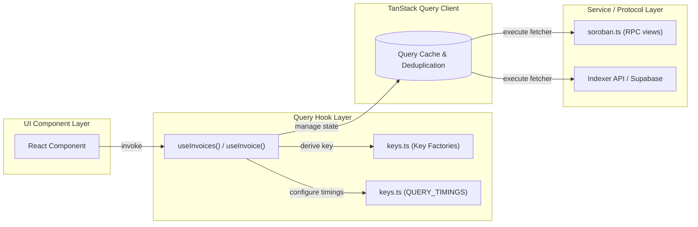

# Data-Fetching Architecture Guide

**Status:** Canonical Reference  
**Applicability:** All frontend network requests, smart-contract reads, indexer queries, and REST interactions  
**Related Tracking Issues:** #905, #154  
**Primary Modules:** `src/hooks/queries/`, `src/hooks/queries/keys.ts`

---

## 1. Overview & Architecture Philosophy

In the Invoice Liquidity Network (ILN) frontend, **all asynchronous data-fetching is consolidated into custom React Query hooks**. UI components must remain declarative presentation layers and are strictly prohibited from implementing raw `fetch()` calls or manual `useEffect()` state synchronization loops for remote data.

### Core Tenets

1. **Single Source of Truth**: All query keys are managed centrally through key factories in [`src/hooks/queries/keys.ts`](../src/hooks/queries/keys.ts).
2. **Predictable Caching & Deduplication**: Cache invalidation, garbage collection, and stale-time parameters are uniform protocol-wide via `QUERY_TIMINGS`.
3. **Resilience & Fallback**: Network queries gracefully handle indexer or RPC downtime with structured fallback states without unmounting components.
4. **Strict Typing**: Query hooks return strongly typed data with well-defined error models.



---

## 2. Directory Layout & Organization

All data-fetching code is organized under `src/hooks/`:

```
src/hooks/
├── queries/
│   ├── keys.ts                 # Centralized key factories and QUERY_TIMINGS table
│   ├── useInvoiceCount.ts      # Query hook for global invoice count
│   ├── useParameterUpdates.ts  # Governance parameter updates query
│   ├── usePayerScore.ts        # Single payer reputation score query
│   ├── usePayerScores.ts       # Batch payer reputation query
│   └── useReputation.ts        # Freelancer reputation score query
├── useInvoices.ts              # Canonical invoice queries (list, detail)
├── useContractStats.ts         # Aggregated protocol statistics query
├── useProtocolStatus.ts        # Circuit breaker / protocol paused status
├── useAdminActions.ts          # Multisig audit log query
└── useTransaction.tsx          # Transaction lifecycle and execution manager
```

---

## 3. Query Key Architecture (`keys.ts`)

Hardcoded string array literals like `["invoices"]` or `["invoice", id]` scattered across components are strictly prohibited because they lead to subtle cache invalidation bugs and typos.

Every query must derive its key from a key factory in `src/hooks/queries/keys.ts`:

```typescript
// src/hooks/queries/keys.ts
export const invoiceKeys = {
  /** All invoices list */
  all: ['invoices'] as const,
  /** Filtered invoice list */
  list: (filters: Record<string, unknown>) => ['invoices', 'list', filters] as const,
  /** A single invoice by id */
  detail: (id: bigint | string | number | null | undefined) => ['invoice', id?.toString()] as const,
  /** Total invoice count */
  count: ['invoice-count'] as const,
};

export const statsKeys = {
  all: ['contract-stats'] as const,
};

export const reputationKeys = {
  detail: (address: string) => ['reputation', address] as const,
  payerScore: (address: string) => ['payer-score', address] as const,
  payerScoresBatch: (addresses: string[]) =>
    ['payer-scores-batch', ...addresses.slice().sort()] as const,
};

export const protocolKeys = {
  status: ['protocol-status'] as const,
};

export const adminKeys = {
  actionHistory: ['admin-action-history'] as const,
};
```

---

## 4. Cache Timings & Defaults (`QUERY_TIMINGS`)

Cache timings represent a deliberate trade-off between network bandwidth, RPC load, and UI data freshness. Timings must be referenced from `QUERY_TIMINGS` rather than hardcoded inline:

```typescript
// src/hooks/queries/keys.ts
export const QUERY_TIMINGS = {
  /** Invoice list — changes often via funding/payment events. */
  invoices: { staleTime: 15_000, gcTime: 5 * 60_000 },
  /** Single invoice detail. */
  invoiceDetail: { staleTime: 30_000, gcTime: 5 * 60_000 },
  /** Cheap invoice counter for the homepage ticker. */
  invoiceCount: { staleTime: 30_000, gcTime: 5 * 60_000 },
  /** Aggregated stats — expensive to compute, tolerate slight staleness. */
  stats: { staleTime: 60_000, gcTime: 10 * 60_000 },
  /** Governance parameter updates — slow-moving. */
  parameterUpdates: { staleTime: 5 * 60_000, gcTime: 30 * 60_000 },
  /** Reputation score — steady, updated periodically. */
  reputation: { staleTime: 30_000, gcTime: 5 * 60_000 },
  /** Protocol status — critical for maintenance banner, poll frequently. */
  protocolStatus: { staleTime: 15_000, gcTime: 5 * 60_000 },
  /** Admin action history — moderate frequency. */
  adminActions: { staleTime: 30_000, gcTime: 5 * 60_000 },
  /** Single payer score. */
  payerScore: { staleTime: 30_000, gcTime: 5 * 60_000 },
  /** Batch payer scores. */
  payerScores: { staleTime: 30_000, gcTime: 5 * 60_000 },
} as const;
```

### Definitions:

- **`staleTime`**: The duration (in milliseconds) before cached data is considered stale. While fresh, queries will not initiate background network refetches upon component remounts or window focus.
- **`gcTime`**: The duration that unused or unobserved cache entries remain in memory before being garbage collected.
- **`refetchInterval`**: Used only on mission-critical status monitors (e.g. `useProtocolStatus` polls every 30s to catch protocol pause events).

---

## 5. Standard Implementation Pattern

### Query Hook Example

```typescript
'use client';

import { useQuery } from '@tanstack/react-query';
import { getInvoiceById } from '@/utils/soroban';
import { invoiceKeys, QUERY_TIMINGS } from './queries/keys';
import type { Invoice } from '@/types';

export function useInvoice(id: bigint | string | undefined) {
  return useQuery<Invoice | null>({
    queryKey: invoiceKeys.detail(id),
    queryFn: () => (id ? getInvoiceById(id) : Promise.resolve(null)),
    enabled: Boolean(id),
    ...QUERY_TIMINGS.invoiceDetail,
  });
}
```

### Mutation & Invalidation Pattern

When executing state changes (e.g., funding an invoice, casting a vote), use `queryClient.invalidateQueries` targeted by key factory:

```typescript
const queryClient = useQueryClient();

const handlePaymentSuccess = async (invoiceId: bigint) => {
  // Invalidate specific invoice detail
  await queryClient.invalidateQueries({
    queryKey: invoiceKeys.detail(invoiceId),
  });

  // Invalidate invoice lists to reflect status update
  await queryClient.invalidateQueries({
    queryKey: invoiceKeys.all,
  });

  // Invalidate protocol summary stats
  await queryClient.invalidateQueries({
    queryKey: statsKeys.all,
  });
};
```

---

## 6. Acceptable Exceptions to Inline Fetching

Direct `fetch()` calls outside of the query-hook pattern are **disallowed** by default. An exception is permitted **only** in the following constrained circumstances:

1. **Ephemeral Lookups in Ephemeral Components**:
   - _Example_: `resolveFederatedAddress(stellarAddress)` during interactive text input typing.
   - _Rationale_: Debounced user inputs whose intermediate values should not occupy global cache slots.
2. **Next.js Server-Side Route Handlers (`app/api/**/route.ts`)\*\*:
   - _Example_: Webhook handlers or external notification dispatches running on Node.js/Edge runtimes without React context.
3. **Legacy Migration Fallbacks**:
   - When a component is undergoing staged migration, inline fetching must be documented with an explicit lint override:
     ```typescript
     // eslint-disable-next-line no-restricted-globals, no-restricted-syntax -- Legacy inline exception pending query hook migration
     const res = await fetch(`${baseUrl}/analytics/...`);
     ```
   - All such exceptions must have a tracking GitHub issue associated with their final migration.

---

## 7. Migration Checklist for Contributors

When introducing new data-fetching requirements:

- [ ] Check if a key factory exists in `src/hooks/queries/keys.ts`. If not, add it.
- [ ] Add appropriate `staleTime` and `gcTime` settings to `QUERY_TIMINGS`.
- [ ] Implement the hook under `src/hooks/queries/` or `src/hooks/`.
- [ ] Export strongly-typed return values with TypeScript.
- [ ] Ensure any modifying actions trigger appropriate cache invalidations via `queryClient.invalidateQueries`.
- [ ] Add unit tests verifying query key derivation and timing parameters (see `src/hooks/__tests__/useReferralStats.test.ts`).
